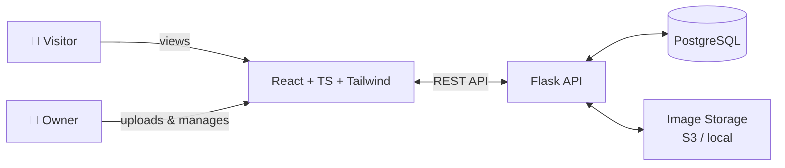
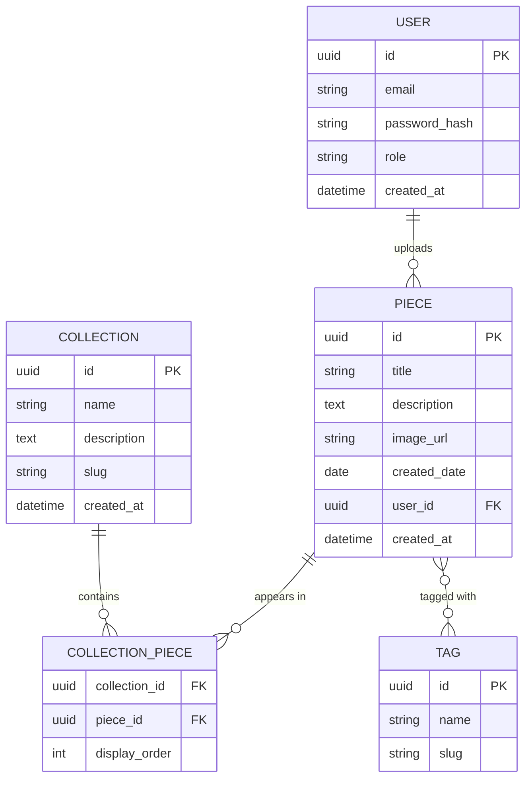

# 🎨 SketchyArt Gallery — Project Overview

> A personal gallery app for storing, organizing, and showcasing drawings. Private upload, public viewing.

---

## 📑 Table of Contents

1. [Problem & Vision](#-problem--vision)
2. [Users & Roles](#-users--roles)
3. [MVP Scope](#-mvp-scope)
4. [Architecture](#-architecture)
5. [Data Model](#-data-model)
6. [Tech Stack](#-tech-stack)
7. [UI/UX Direction](#-uiux-direction)
8. [Monetization](#-monetization)
9. [Documentation Map](#-documentation-map)
10. [Open Questions](#-open-questions)

---

## 🎯 Problem & Vision

A personal web app to **store, organize, and showcase** my own drawings — replacing scattered folders, social media posts, and cloud storage with a single curated home for the work.

**Long-term:** open the gallery to the public as a portfolio anyone can browse.

---

## 👥 Users & Roles

| Role | Permissions |
|------|-------------|
| 🎨 **Owner** (me) | Upload, edit, delete, organize, manage collections & tags |
| 👀 **Visitor** (public) | View gallery, browse collections, filter by tags |

> No public sign-ups in MVP. Authentication is owner-only.

---

## ✅ MVP Scope

**In scope**
- Public gallery view (grid + individual piece view)
- Owner authentication
- Owner-only upload (with metadata: title, description, tags, date)
- Curated collections (manually grouped pieces)
- Tag-based browsing

**Out of scope (for now)**
- Public user accounts
- Comments, likes, social features
- E-commerce / prints
- Mobile apps (responsive web only)

---

## 🏗️ Architecture



**Flow:** Frontend (React SPA) ↔ Flask REST API ↔ PostgreSQL + image storage.

---

## 🗃️ Data Model

### Entity Relationship



### Rough SQLAlchemy Draft

> 📝 **Rough draft only.** Field types, constraints, and indexes will likely change once API endpoints and queries are designed. Uses SQLAlchemy 2.0 declarative style with `Mapped` / `mapped_column`.

```python
# ROUGH DRAFT — schema reference, expect changes
# models.py

import uuid
from datetime import datetime, date
from enum import Enum
from sqlalchemy import String, Text, ForeignKey, DateTime, Date, Integer, Table, Column
from sqlalchemy.orm import DeclarativeBase, Mapped, mapped_column, relationship
from sqlalchemy.dialects.postgresql import UUID


class Base(DeclarativeBase):
    pass


class Role(str, Enum):
    OWNER = "owner"
    VISITOR = "visitor"


# Association table: Piece <-> Tag (many-to-many)
piece_tags = Table(
    "piece_tags",
    Base.metadata,
    Column("piece_id", UUID(as_uuid=True), ForeignKey("pieces.id"), primary_key=True),
    Column("tag_id", UUID(as_uuid=True), ForeignKey("tags.id"), primary_key=True),
)


class User(Base):
    __tablename__ = "users"

    id: Mapped[uuid.UUID] = mapped_column(UUID(as_uuid=True), primary_key=True, default=uuid.uuid4)
    email: Mapped[str] = mapped_column(String(255), unique=True, nullable=False)
    password_hash: Mapped[str] = mapped_column(String(255), nullable=False)
    role: Mapped[Role] = mapped_column(String(20), default=Role.VISITOR, nullable=False)
    created_at: Mapped[datetime] = mapped_column(DateTime, default=datetime.utcnow)

    pieces: Mapped[list["Piece"]] = relationship(back_populates="user")


class Piece(Base):
    __tablename__ = "pieces"

    id: Mapped[uuid.UUID] = mapped_column(UUID(as_uuid=True), primary_key=True, default=uuid.uuid4)
    title: Mapped[str] = mapped_column(String(255), nullable=False)
    description: Mapped[str | None] = mapped_column(Text)
    image_url: Mapped[str] = mapped_column(String(500), nullable=False)
    created_date: Mapped[date | None] = mapped_column(Date)  # when the artwork was made
    user_id: Mapped[uuid.UUID] = mapped_column(ForeignKey("users.id"), index=True)
    created_at: Mapped[datetime] = mapped_column(DateTime, default=datetime.utcnow)
    updated_at: Mapped[datetime] = mapped_column(DateTime, default=datetime.utcnow, onupdate=datetime.utcnow)

    user: Mapped["User"] = relationship(back_populates="pieces")
    collections: Mapped[list["CollectionPiece"]] = relationship(back_populates="piece")
    tags: Mapped[list["Tag"]] = relationship(secondary=piece_tags, back_populates="pieces")


class Collection(Base):
    __tablename__ = "collections"

    id: Mapped[uuid.UUID] = mapped_column(UUID(as_uuid=True), primary_key=True, default=uuid.uuid4)
    name: Mapped[str] = mapped_column(String(255), nullable=False)
    slug: Mapped[str] = mapped_column(String(255), unique=True, nullable=False)
    description: Mapped[str | None] = mapped_column(Text)
    created_at: Mapped[datetime] = mapped_column(DateTime, default=datetime.utcnow)

    pieces: Mapped[list["CollectionPiece"]] = relationship(back_populates="collection")


class CollectionPiece(Base):
    __tablename__ = "collection_pieces"

    collection_id: Mapped[uuid.UUID] = mapped_column(ForeignKey("collections.id"), primary_key=True)
    piece_id: Mapped[uuid.UUID] = mapped_column(ForeignKey("pieces.id"), primary_key=True)
    display_order: Mapped[int] = mapped_column(Integer, default=0)

    collection: Mapped["Collection"] = relationship(back_populates="pieces")
    piece: Mapped["Piece"] = relationship(back_populates="collections")


class Tag(Base):
    __tablename__ = "tags"

    id: Mapped[uuid.UUID] = mapped_column(UUID(as_uuid=True), primary_key=True, default=uuid.uuid4)
    name: Mapped[str] = mapped_column(String(100), unique=True, nullable=False)
    slug: Mapped[str] = mapped_column(String(100), unique=True, nullable=False)

    pieces: Mapped[list["Piece"]] = relationship(secondary=piece_tags, back_populates="tags")
```

**Migration tooling:** use [Alembic](https://alembic.sqlalchemy.org) for schema versioning. Initial setup:

```bash
pip install flask-sqlalchemy alembic psycopg2-binary
alembic init migrations
alembic revision --autogenerate -m "initial schema"
alembic upgrade head
```

---

## 🛠️ Tech Stack

### Frontend
| Tool | Purpose | Link |
|------|---------|------|
| ⚛️ React | UI framework | [react.dev](https://react.dev) |
| 🔷 TypeScript | Type safety | [typescriptlang.org](https://www.typescriptlang.org) |
| 🎨 Tailwind CSS | Styling | [tailwindcss.com](https://tailwindcss.com) |

### Backend
| Tool | Purpose | Link |
|------|---------|------|
| 🐍 Python | Language | [python.org](https://www.python.org) |
| 🌶️ Flask | REST API framework | [flask.palletsprojects.com](https://flask.palletsprojects.com) |
| 🐘 PostgreSQL | Relational DB | [postgresql.org](https://www.postgresql.org) |
| 🔧 SQLAlchemy | ORM (recommended) | [sqlalchemy.org](https://www.sqlalchemy.org) |

### Likely additions to consider
- **Image storage:** AWS S3, Cloudflare R2, or local filesystem for MVP
- **Auth:** Flask-Login or JWT (single-owner login is simple)
- **Migrations:** Alembic
- **Image processing:** Pillow (thumbnails, format conversion)

---

## 🎭 UI/UX Direction

**Concept:** *The Silent Curator* — Modern Minimalist Dark aesthetic.

**Principles**
- The artwork is the protagonist; the UI disappears.
- Generous negative space.
- Restrained typography and chromeless navigation.
- Dark background to reduce visual competition with pieces.

📄 Full direction lives in [`DESIGN.md`](./DESIGN.md).

---

## 💰 Monetization

**None.** This is a personal portfolio and a learning project — no plans for revenue, ads, or subscriptions.

---

## 📚 Documentation Map

| File | Purpose |
|------|---------|
| `README.md` | Setup, run instructions, contributor entry point |
| `PROJECT.md` | High-level pillars (this overview is its expanded form) |
| `AGENTS.md` | Rules and context for AI/agentic workflows |
| `DESIGN.md` | Visual identity, design tokens, UX principles |

---

## ❓ Open Questions

- [ ] Where will images be stored in production? (S3 vs R2 vs local)
- [ ] Will pieces support multiple images (e.g., process shots)?
- [ ] Public-facing slug strategy for shareable URLs?
- [ ] Backup strategy for the DB and image storage?
- [ ] Search — full-text on titles/descriptions, or tag-only?
