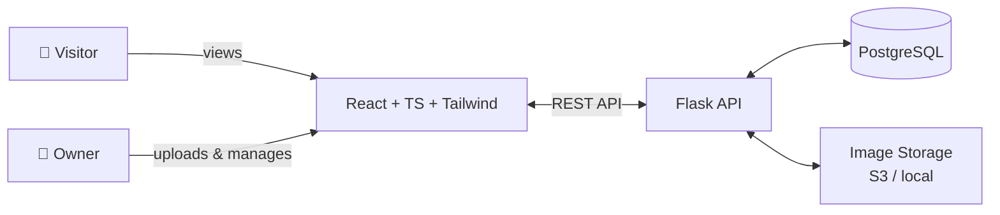
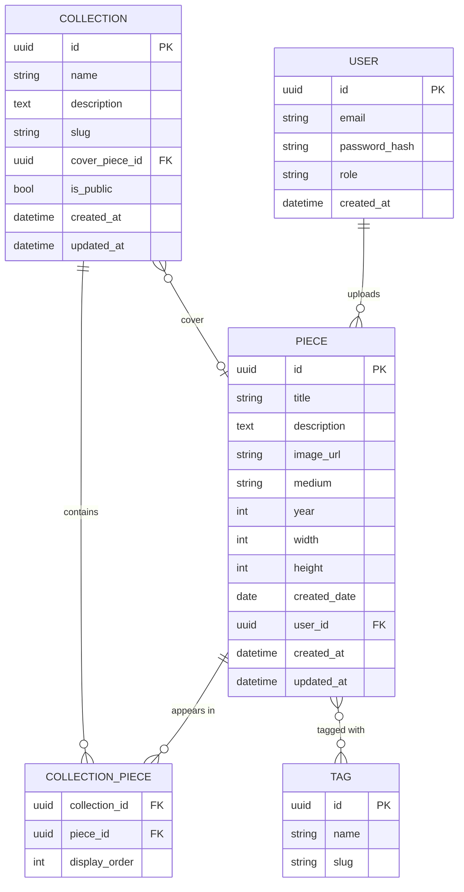

# 🎨 SketchyArt Gallery — Project Overview

> A personal gallery app for storing, organizing, and showcasing drawings. Private upload, public viewing.

---

## 📑 Table of Contents

1. [Problem & Vision](#-problem--vision)
2. [Users & Roles](#-users--roles)
3. [MVP Scope](#-mvp-scope)
4. [Architecture](#-architecture)
5. [Data Model](#-data-model)
6. [Tech Stack](#-tech-stack)
7. [UI/UX Direction](#-uiux-direction)
8. [Monetization](#-monetization)
9. [Documentation Map](#-documentation-map)
10. [Open Questions](#-open-questions)

---

## 🎯 Problem & Vision

A personal web app to **store, organize, and showcase** my own drawings — replacing scattered folders, social media posts, and cloud storage with a single curated home for the work.

**Long-term:** open the gallery to the public as a portfolio anyone can browse.

---

## 👥 Users & Roles

| Role | Permissions |
|------|-------------|
| 🎨 **Owner** (me) | Upload, edit, delete, organize, manage collections & tags |
| 👀 **Visitor** (public) | View gallery, browse collections, filter by tags |

> No public sign-ups in MVP. Authentication is owner-only.

---

## ✅ MVP Scope

**In scope**
- Public gallery view (grid + individual piece view)
- Owner authentication
- Owner-only upload (with metadata: title, description, tags, date)
- Curated collections (manually grouped pieces)
- Tag-based browsing

**Out of scope (for now)**
- Public user accounts
- Comments, likes, social features
- E-commerce / prints
- Mobile apps (responsive web only)

---

## 🏗️ Architecture


```mermaid
flowchart LR
    Visitor[👀 Visitor] -->|views| FE[React + TS + Tailwind]
    Owner[🎨 Owner] -->|uploads & manages| FE
    FE <-->|REST API| BE[Flask API]
    BE <--> DB[(PostgreSQL)]
    BE <--> Storage[Image Storage<br/>S3 / local]
```

**Flow:** Frontend (React SPA) ↔ Flask REST API ↔ PostgreSQL + image storage.

---

## 🗃️ Data Model

### Entity Relationship


```mermaid
erDiagram
    USER ||--o{ PIECE : uploads
    PIECE ||--o{ COLLECTION_PIECE : "appears in"
    COLLECTION ||--o{ COLLECTION_PIECE : "contains"
    COLLECTION }o--o| PIECE : "cover"
    PIECE }o--o{ TAG : "tagged with"

    USER {
        uuid id PK
        string email
        string password_hash
        string role
        datetime created_at
    }
    PIECE {
        uuid id PK
        string title
        text description
        string image_url
        string medium
        int year
        int width
        int height
        date created_date
        uuid user_id FK
        datetime created_at
        datetime updated_at
    }
    COLLECTION {
        uuid id PK
        string name
        text description
        string slug
        uuid cover_piece_id FK
        bool is_public
        datetime created_at
        datetime updated_at
    }
    COLLECTION_PIECE {
        uuid collection_id FK
        uuid piece_id FK
        int display_order
    }
    TAG {
        uuid id PK
        string name
        string slug
    }
```

### Models

The schema is implemented in [`backend/app/models.py`](../backend/app/models.py)
and created by the initial Alembic revision. It is no longer duplicated here --
read the models; they are the source of truth.

Decisions worth knowing, made when the collections feature was built:

- **`Uuid` (generic) rather than the Postgres dialect type.** Renders as a
  native `uuid` on Postgres and `CHAR(32)` elsewhere, which lets the API be
  exercised against in-memory SQLite without a second set of models.
- **`Piece` gained `medium`, `year`, `width`, `height`.** The first two are
  rendered on every card; the last two produce the aspect ratio the masonry
  needs. Measuring dimensions in the browser instead would reflow the grid
  as images load, so they are recorded at upload.
- **`Collection.cover_piece_id`** is a nullable FK to one of its own pieces,
  `ON DELETE SET NULL`. Chosen over a separate cover upload: no extra
  storage, no orphaned files, and a cover can never show artwork the
  collection does not contain. Falls back to the first member, then to a
  gradient swatch in the UI.
- **`Collection.is_public`** lets the owner curate before publishing.
- **`display_order` is not unique.** Membership is replaced as one ordered
  list, and a uniqueness constraint would trip on the transient duplicates
  any reshuffle passes through. The composite primary key already prevents
  a piece appearing twice in one collection.
- **Cascades delete memberships, never artwork.** Removing a collection or a
  piece clears the join rows; the pieces themselves survive.
- **`pieceCount` is derived, not stored.** A counter column would be one bug
  away from drifting for no measurable gain at this scale.

**Migration tooling:** [Alembic](https://alembic.sqlalchemy.org), already set
up in `backend/migrations`. Full instructions in
[`backend/README.md`](../backend/README.md):

```bash
cd backend
.venv/Scripts/alembic.exe revision --autogenerate -m "what changed"
.venv/Scripts/alembic.exe upgrade head
```

> Note: the stack is plain **SQLAlchemy 2.0**, not Flask-SQLAlchemy -- the
> models stay importable outside an app context, which is what lets the
> smoke test run them against SQLite. The driver is **psycopg 3**, not
> `psycopg2-binary`, which has no wheels for Python 3.14.

---

## 🛠️ Tech Stack

### Frontend
| Tool | Purpose | Link |
|------|---------|------|
| ⚛️ React | UI framework | [react.dev](https://react.dev) |
| 🔷 TypeScript | Type safety | [typescriptlang.org](https://www.typescriptlang.org) |
| 🎨 Tailwind CSS | Styling | [tailwindcss.com](https://tailwindcss.com) |

### Backend
| Tool | Purpose | Link |
|------|---------|------|
| 🐍 Python | Language | [python.org](https://www.python.org) |
| 🌶️ Flask | REST API framework | [flask.palletsprojects.com](https://flask.palletsprojects.com) |
| 🐘 PostgreSQL | Relational DB | [postgresql.org](https://www.postgresql.org) |
| 🔧 SQLAlchemy | ORM (recommended) | [sqlalchemy.org](https://www.sqlalchemy.org) |

### Likely additions to consider
- **Image storage:** AWS S3, Cloudflare R2, or local filesystem for MVP
- **Auth:** Flask-Login or JWT (single-owner login is simple)
- **Migrations:** Alembic
- **Image processing:** Pillow (thumbnails, format conversion)

---

## 🎭 UI/UX Direction

**Concept:** *The Silent Curator* — quiet, editorial, restrained.

**Principles**
- The artwork is the protagonist; the UI disappears.
- Generous negative space.
- Restrained typography and chromeless navigation.
- Sharp corners, hairline rules, no shadows. Depth is a 1px border, nothing more.
- A single muted gold accent, spent sparingly.
- Dark and light themes of equal standing, chosen by the viewer and remembered.

📄 Full direction lives in [`DESIGN.md`](./DESIGN.md).

---

## 💰 Monetization

**None.** This is a personal portfolio and a learning project — no plans for revenue, ads, or subscriptions.

---

## 📚 Documentation Map

| File | Purpose |
|------|---------|
| `README.md` | Setup, run instructions, contributor entry point |
| `PROJECT.md` | High-level pillars (this overview is its expanded form) |
| `AGENTS.md` | Rules and context for AI/agentic workflows |
| `DESIGN.md` | Visual identity, design tokens, UX principles |

---

## ❓ Open Questions (For)

- [ ] Where will images be stored in production? (S3 vs R2 vs local)
+ [x] For now, in development, local folder.
- [ ] Will pieces support multiple images (e.g., process shots)?
+ [ ] No for now.
- [ ] Public-facing slug strategy for shareable URLs?
+ [ ] Not for now.
- [ ] Backup strategy for the DB and image storage?
+ [ ] Not for now.
- [ ] Search — full-text on titles/descriptions, or tag-only?
+ [ ] Yes, for now just titles and descriptions.
